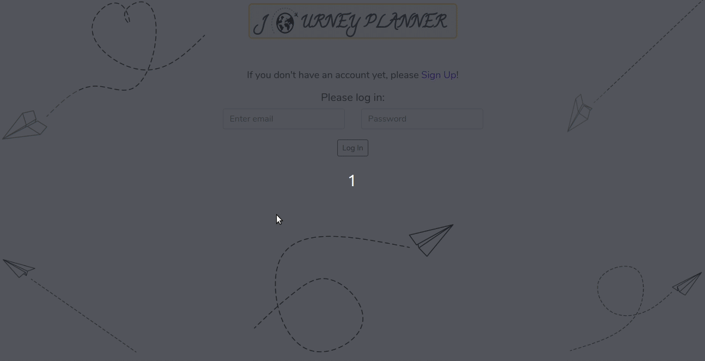

# Journey Planner - Client

## What this project is about

This project is a result of a Hackathon, where the challenge was to use at least one technology, that was not taught throughout the Code Academy course, by Codaisseur.
The Hackathon's theme was travel.
(Check out the technologies used at the end of the Readme.)

This is a journey planner application, where a registered user can access the site's features, which are:

- creating journeys with name, date and destination country
  - creating events for each journey, that are displayed on a timeline
  - creating an editable packing list for each journey
  - getting useful info about the destination country
- deleting existing journeys
- deleting existing events

* **[Server](https://github.com/adeltancsik/server-journey-planner)**
  Contains the end points and database models.

## Table of contents:

- **[How to install](#how-to-install)**
- **[Features built so far and the routes](#features-built-so-far)**
- **[Create React App docs](#create-react-app)**
- **[Technologies](#technologies)**

## How to install

1. Clone the git repository
   `git clone git@github.com:adeltancsik/client-journey-planner.git`

2. cd into the folder client-journey-planner

3. Run npm install and Before launching the app( with npm start ), please make sure that the server side is up and running. Also don't forget to use docker for a local db.

4. Run npm start. The app runs in the development mode on http://localhost:3000 in the browser.

5. Checkout the **[Server ReadMe](https://github.com/adeltancsik/server-journey-planner)** to install and run the server.

## Features built so far

## Create React App

This project was scaffolded using the create-react-app cli.

**[The standard create-react-app docs can be found in here](./create-react-app-docs.md)**

## Technologies

- "New" technologies used:
  - react hooks
  - moment.js
  - react-input-moment
  - react bootstrap
  - vertical-timeline-component-for-react
- Other technologies:
  - react
  - redux
  - superagent
